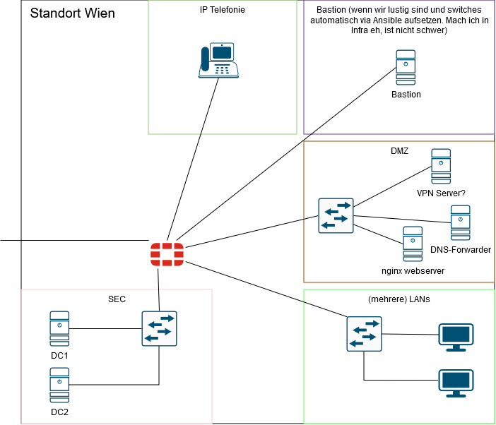

# Automatisierung

Python Skripte

# Backbone

## ISP 1

|           |      |
| --------- | ---- |
| AS-Nummer | 1    |
| Underlay  | OSPF |
| Overlay   | MPLS |

## ISP 2

|           |        |
| --------- | ------ |
| AS-Nummer | 2      |
| Underlay  | OSPF   |
| Overlay   | DM GRE |

# Standort 1 - Wien

## Netzwerk

2 Domaincontroller
2 redundante Uplinks (FortiGate Firewalls)
Clients

## Active Directory

### Users/Groups

### OUs

### GPOs

# Standort 2

# Standort 3
