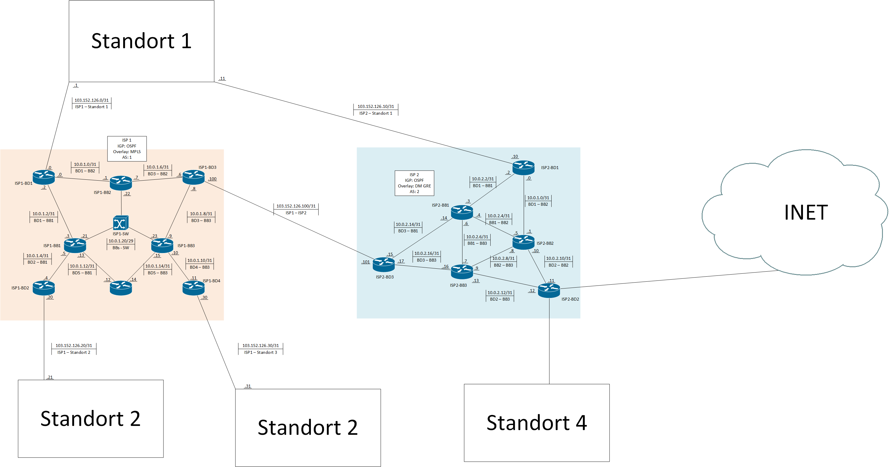

# Big Topo Tagebuch

| Tag        | Team              |
| ---------- | ----------------- |
| 20.11.2024 | Frühstück & Uhlig |

## Inhaltsverzeichnis

- [Big Topo Tagebuch](#big-topo-tagebuch)
  - [Inhaltsverzeichnis](#inhaltsverzeichnis)
  - [Beschreibung der erledigten Arbeit](#beschreibung-der-erledigten-arbeit)
  - [Arbeitspakete](#arbeitspakete)
    - [Erledigt](#erledigt)
    - [Angefangen](#angefangen)
    - [Anstehend](#anstehend)
  - [Ergebnisse](#ergebnisse)
    - [Aktueller Netzplan](#aktueller-netzplan)
    - [ISP1 Skripts](#isp1-skripts)
    - [Gruppendiagramm](#gruppendiagramm)
    - [Neue Spezifikationen](#neue-spezifikationen)

## Beschreibung der erledigten Arbeit

Wir haben heute den Netzplan verfeinert und mit der Konfiguration des Backbones begonnen. Der ISP 1 ist jetzt fertig konifguriert. Es ist außerdem eine Gruppenstruktur für das Active Directory erstellt.

## Arbeitspakete

### Erledigt

1. Konfiguration ISP1
2. AD Gruppen Struktur

### Angefangen

1. AD OU Struktur

### Anstehend

1. ISP 2 Skripts
2. Automatisierung beginnen
3. PS Skripts für DC Konfiguration

## Ergebnisse

### Aktueller Netzplan

[Backbone-Bild](../plan/Netzplan/Backbone.png)

### ISP1 Skripts

- [ISP1-BB1](../scripts/ISP_1/ISP1-BB1.ios)
- [ISP1-BB2](../scripts/ISP_1/ISP1-BB2.ios)
- [ISP1-BB3](../scripts/ISP_1/ISP1-BB3.ios)
- [ISP1-BD1](../scripts/ISP_1/ISP1-BD1.ios)
- [ISP1-BD2](../scripts/ISP_1/ISP1-BD2.ios)
- [ISP1-BD3](../scripts/ISP_1/ISP1-BD3.ios)

### Gruppendiagramm

[Gruppen-Bild](../plan/AD/Gruppen/Gruppen.png)

### Neue Spezifikationen

[Spezifikationen](../Spezifikationen.md)
