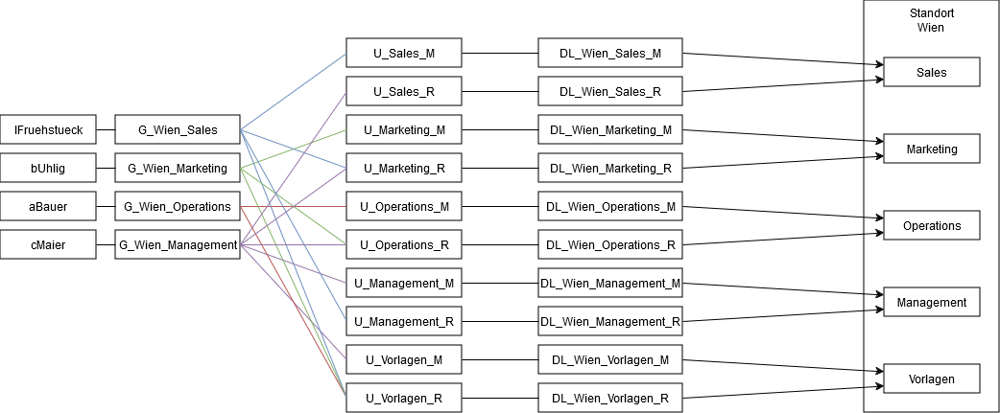

# Big Topo Tagebuch

| Tag        | Team              |
| ---------- | ----------------- |
| 04.01.2025 | Frühstück & Uhlig |

## Inhaltsverzeichnis

- [Big Topo Tagebuch](#big-topo-tagebuch)
  - [Inhaltsverzeichnis](#inhaltsverzeichnis)
  - [Beschreibung der erledigten Arbeit](#beschreibung-der-erledigten-arbeit)
  - [Arbeitspakete](#arbeitspakete)
    - [Erledigte](#erledigte)
    - [Angefangene](#angefangene)
    - [Anstehende](#anstehende)
  - [Änderungen](#änderungen)
  - [Ergebnisse](#ergebnisse)
    - [Windows Server](#windows-server)
    - [Gruppendiagramm](#gruppendiagramm)

## Beschreibung der erledigten Arbeit

Wir haben heute die AD-Gruppen vorerst fertiggestellt - müssen noch an eventuell an verschiedene Domains angepasst werden. Geiches gilt für die OUs, diese müssen eventuell noch angepasst werden. Sonst wurde Standort 1 (Wien) grob ausdefiniert

## Arbeitspakete

### Erledigte

1. Konfiguration ISP1
2. AD Gruppen Struktur
3. AD OU Struktur

### Angefangene

1. PS Skripts für DC Konfiguration

### Anstehende

1. ISP 2 Skripts
2. Automatisierung beginnen
3. Plan ändern auf 3. Standort

## Änderungen

Die AD-Gruppenstruktur wurde geändert, weil sie nicht auf mehrere Domains ausgelegt war

## Ergebnisse

### Windows Server

[DC1](../scripts/Standort_Wien/dc1.ps1)

### Gruppendiagramm

[Gruppen](../plan/AD/Gruppen/Gruppen.png)

[OUs](../plan/AD/OUs/OU-Struktur.png)

