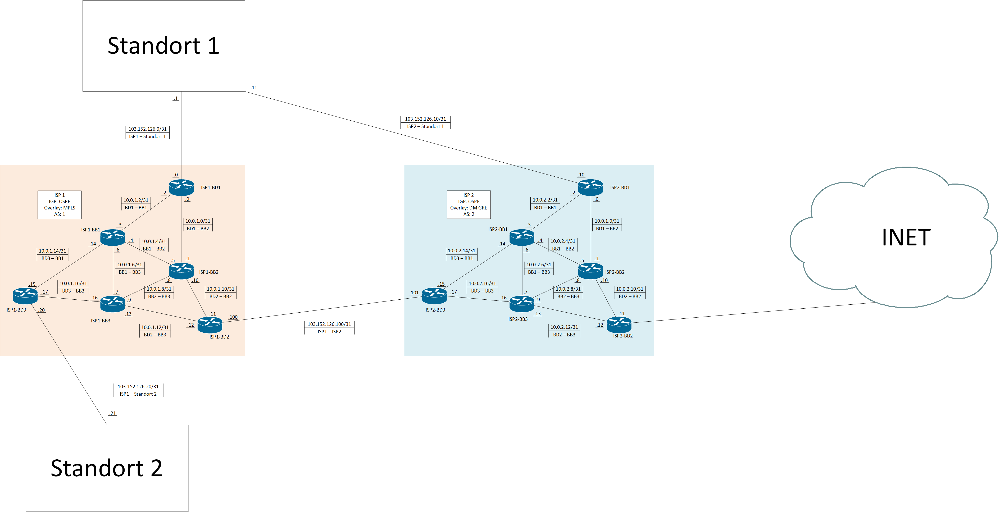

# Automatisierung

Python Skripte

# Backbone

## ISP 1

|           |      |
| --------- | ---- |
| AS-Nummer | 1    |
| Underlay  | OSPF |
| Overlay   | MPLS |

## ISP 2

|           |        |
| --------- | ------ |
| AS-Nummer | 2      |
| Underlay  | OSPF   |
| Overlay   | DM GRE |

# Standort 1

## Netzwerk

2 Domaincontroller
2 redundante Uplinks (FortiGate Firewalls)
Clients

## Active Directory

### Users/Groups

| Users        | Globals      | Domain Locals   |
| ------------ | ------------ | --------------- |
| lFruehstueck | G_Sales      | DL_Sales_M      |
| bUhlig       | G_Marketing  | DL_Sales_R      |
| aBauer       | G_Operations | DL_Marketing_M  |
| cMaier       | G_Management | DL_Marketing_R  |
|              |              | DL_Operations_M |
|              |              | DL_Operations_R |
|              |              | DL_Management_M |
|              |              | DL_Management_R |
|              |              | DL_Vorlagen_M   |
|              |              | DL_Vorlagen_R   |

### GPOs

# Standort 2
