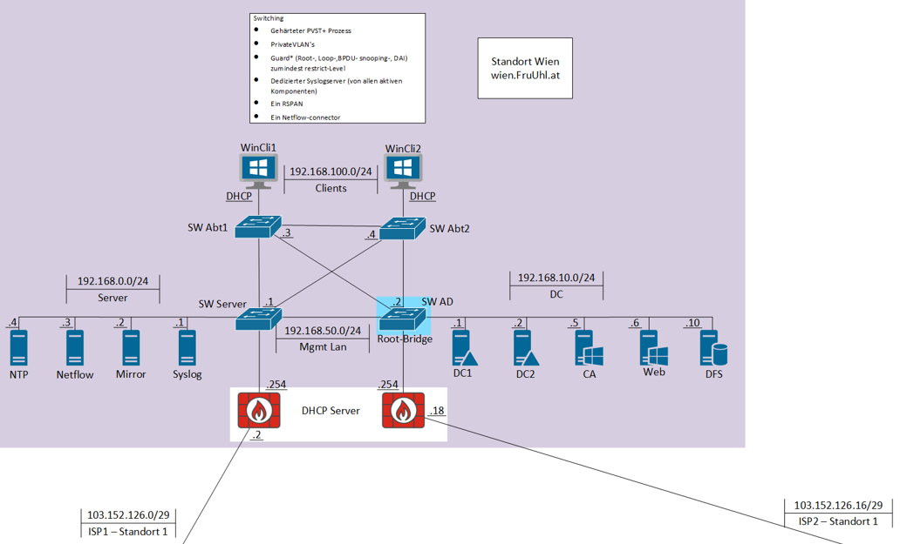
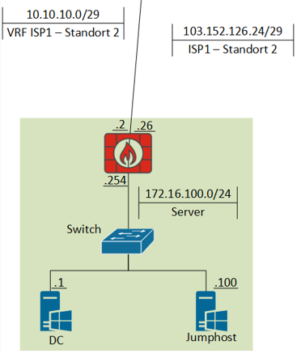
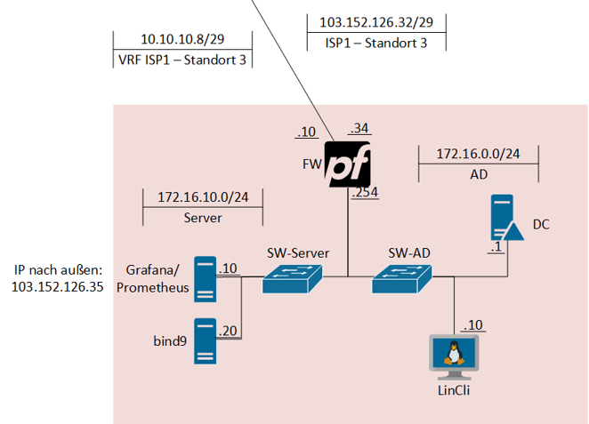

# FW Dokumentation

## Inhaltsverzeichnis

- [FW Dokumentation](#fw-dokumentation)
  - [Inhaltsverzeichnis](#inhaltsverzeichnis)
  - [FG Wien](#fg-wien)
    - [Plan Wien](#plan-wien)
    - [Features FG Wien](#features-fg-wien)
  - [FG Rennweg](#fg-rennweg)
    - [Plan Rennweg](#plan-rennweg)
    - [Features FG Rennweg](#features-fg-rennweg)
  - [PF Graz](#pf-graz)
    - [Plan Graz](#plan-graz)
    - [Features PF Graz](#features-pf-graz)

## FG Wien

### Plan Wien

### Features FG Wien

- HA Cluster
- NAT/PAT
- Granulare Policies
- Traffic Shaping
- Captive Portal
- DHCP
- Subinterfaces
- Site2Site VPN mit anderer FortiGate
  - (FG Rennweg)
- Site2Site VPN mit PfSense
  - (PF Graz)
- RAS VPN zu WinCli auf IPsec Basis
- Redundanter ISP

## FG Rennweg

### Plan Rennweg

### Features FG Rennweg

- NAT/PAT
- Site2Site VPN mit anderer FortiGate
  - (FG Wien)
- OSPF um private Netzte für VRF bekanntzugeben
- Distribution Listen um Netze nicht via OSPF zu teilen

## PF Graz

### Plan Graz

### Features PF Graz

- NAT/PAT
- Subinterfaces
- Site2Site VPN mit FortiGate
  - (FG Wien)
- OSPF um private Netzte für VRF bekanntzugeben
- Distribution Listen um Netze nicht via OSPF zu teilen
- Static NAT
  - Grafana Server
- WireGuard RAS VPN für WinCli
