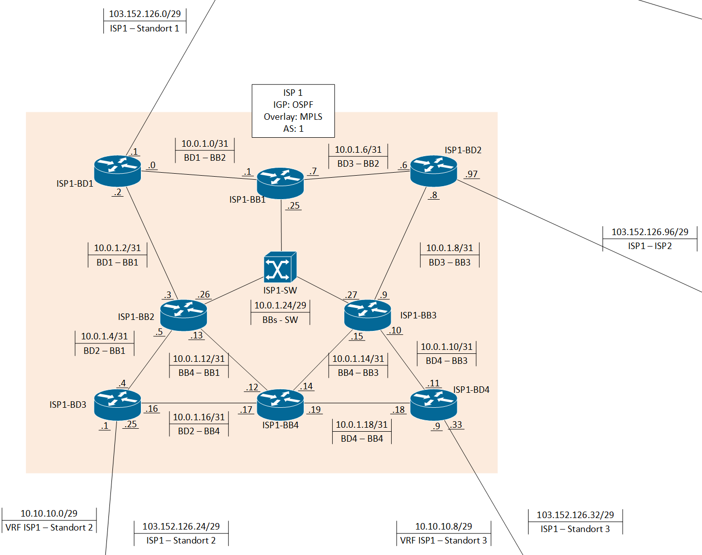

# ISP 1

## Inhaltsverzeichnis

- [ISP 1](#isp-1)
  - [Inhaltsverzeichnis](#inhaltsverzeichnis)
  - [Plan](#plan)
  - [Allgemeine Informationen](#allgemeine-informationen)

## Plan

## Allgemeine Informationen

- 4 Border Router
- 3 Backbone Router
- 1 Switch

IGP: OSPF

Overlay Netz : MPLS

Netz: 10.0.1.0 - 10.0.1.18 /31

Loopbacks für BGP: 10.0.1.101 - 10.0.1.104 /32

Bogon Filter auf den public Interfaces

Ein VRF auf Border 3 & Border 4 um Standort Rennweg mit Graz zu verbinden.
