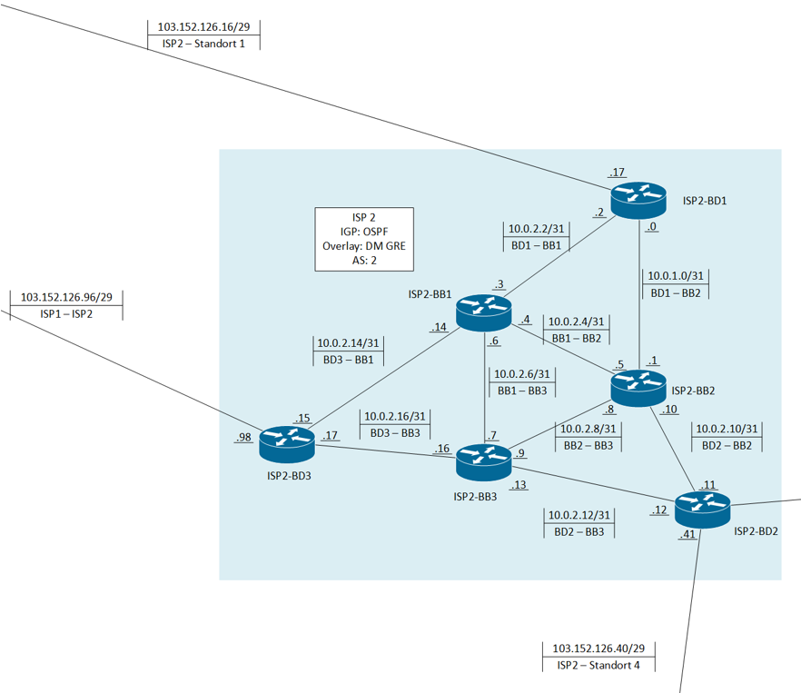

# ISP 1

## Inhaltsverzeichnis

- [ISP 1](#isp-1)
  - [Inhaltsverzeichnis](#inhaltsverzeichnis)
  - [Plan](#plan)
  - [Allgemeine Informationen](#allgemeine-informationen)
  - [Grundkonfig](#grundkonfig)
  - [Interfaces](#interfaces)
  - [Bogon Block ACL](#bogon-block-acl)
  - [OSPF](#ospf)
  - [BGP](#bgp)
  - [DMVPN](#dmvpn)

## Plan



## Allgemeine Informationen

- 3 Border Router
- 3 Backbone Router

IGP: OSPF

Overlay Netz : DMVPN

Netz: 10.0.2.0 - 10.0.2.16 /31

Loopbacks für BGP: 10.0.2.101 - 10.0.2.103 /32

Loopbacks für den DMVPN: 10.0.2.111 - 10.0.2.113 /32

Bogon Filter auf den public Interfaces

Eine default Route, die via BGP weitergegeben wird.

## Grundkonfig

Siehe ISP1

## Interfaces

```bash
!Interfaces
conf t

! Interface zur Verbindung mit ISP2-BB2
int g0/0
    desc to_ISP2-BB2
    ip add 10.0.2.0 255.255.255.254  ! Setzt die IP-Adresse mit einer /31-Subnetzmaske
    ip ospf authentication key-chain OSPF  ! Aktiviert die OSPF-Authentifizierung
    no shut  ! Aktiviert das Interface
exit

! Interface zur Verbindung mit ISP2-BB1
int g0/1
    desc to_ISP2-BB1
    ip add 10.0.2.2 255.255.255.254  ! Setzt die IP-Adresse mit einer /31-Subnetzmaske
    ip ospf authentication key-chain OSPF  ! Aktiviert die OSPF-Authentifizierung
    no shut  ! Aktiviert das Interface
exit

! Interface zur Verbindung mit Standort1
int g0/2
    desc to_Standort1
    ip add 103.152.126.17 255.255.255.248  ! Setzt die IP-Adresse mit einer /29-Subnetzmaske
    ip access-group BLOCK_PRIVATE_AND_LOOPBACK in  ! Filtert privaten und Loopback-Traffic
    no shut  ! Aktiviert das Interface
exit

! Loopback-Interface für BGP
int lo1
    desc loopback_for_BGP
    ip add 10.0.2.101 255.255.255.255  ! Setzt eine /32-IP für BGP
    no shut  ! Aktiviert das Interface
exit

! Loopback-Interface für Tunnel
int lo2
    desc for_tunnel
    ip add 10.0.2.111 255.255.255.255  ! Setzt eine /32-IP für Tunnelverbindungen
    no shut  ! Aktiviert das Interface
exit
```

## Bogon Block ACL

Siehe ISP 1

## OSPF

Es gibt zwei OSPF Prozesse.
Der erste ist um die Netzte zwischen den Routern für OSPF zu aktivieren und die Loopbacks für die Tunnel auszutauschen.
Der zweite Prozess dient dazu, über das DMVPN die Loopbacks für BGP auszutauschen.

```bash
! Keychains-Konfiguration für OSPF-Authentifizierung
conf t

key chain OSPF  # Erstellt eine Keychain für OSPF
    key 1  # Definiert den ersten Schlüssel in der Keychain
        cryptographic-algorithm hmac-sha-512  # Setzt den Verschlüsselungsalgorithmus auf HMAC-SHA-512
        key-string OSPFSECRETKEY  # Legt den geheimen Schlüssel für die Authentifizierung fest
end

!OSPF
conf t

! OSPF-Prozess 1 - Primärer OSPF-Router für Area 1
router ospf 1
router-id 10.0.2.0 ! Setzt die eindeutige Router-ID für OSPF 1

    network 10.0.2.0 0.0.0.1 area 1  ! Fügt das Netzwerk 10.0.2.0/31 zu Area 1 hinzu
    network 10.0.2.2 0.0.0.1 area 1  ! Fügt das Netzwerk 10.0.2.2/31 zu Area 1 hinzu
    network 10.0.2.111 0.0.0.0 area 1  ! Fügt die Loopback-Adresse 10.0.2.111/32 zu Area 1 hinzu

exit

! OSPF-Prozess 2 - Zweiter OSPF-Prozess für Area 2
router ospf 2
router-id 10.0.2.111 ! Setzt die eindeutige Router-ID für OSPF 2

    network 101.100.12.0 0.0.0.255 area 2  ! Fügt das Netzwerk 101.100.12.0/24 zu Area 2 hinzu
    network 10.0.2.101 0.0.0.0 area 2  ! Fügt die Loopback-Adresse 10.0.2.101/32 zu Area 2 hinzu

end
```

## BGP

Siehe ISP 1

## DMVPN

Es gibt einen DMVPN zwischen den drei Border Routern. Dieser dient als Overlay Netzwerk. Der VPN ist verschlüsselt das gleiche gilt auch für den OSPF Prozess, der über das Overlay läuft.

```bash
!Tunnel
int tun1
    desc multipoint_tunnel  ! Beschreibung des Tunnels
    ip add 101.100.12.1 255.255.255.0  ! IP-Adresse und Subnetzmaske für das Tunnelinterface
    tunnel mode gre multipoint  ! GRE-Tunnel im Multipoint-Modus
    tunnel source lo2  ! Quelle des Tunnels ist Loopback 2
    no ip redirects  ! Deaktiviert ICMP-Redirects für Sicherheit
    ip mtu 1440  ! Setzt die maximale Übertragungsgröße für den Tunnel
    ip nhrp authentication cisco123  ! NHRP-Authentifizierung mit Passwort
    ip nhrp map multicast dynamic  ! Erlaubt dynamisches Multicast-Mapping über NHRP
    ip nhrp network-id 1  ! Setzt die Netzwerk-ID für NHRP
    no shut  ! Aktiviert das Interface
exit

!VPN
crypto isakmp policy 10
    encryption aes 256  ! Starke AES-256-Verschlüsselung
    lifetime 86400  ! Lebensdauer des Schlüssels auf 24 Stunden gesetzt
    hash sha512  ! SHA-512 für starke Integritätsprüfung
    group 5  ! Diffie-Hellman Gruppe 5 für Schlüsselaustausch
    authentication pre-share  ! Pre-Shared Key zur Authentifizierung
exit

crypto isakmp key cisco123! address 0.0.0.0  ! Setzt den Pre-Shared Key für alle IP-Adressen

crypto ipsec transform-set 5CN esp-sha512-hmac esp-aes 256
    mode transport  ! Transportmodus für IPSec
exit

crypto ipsec profile IPSEC_PROF
    set transform-set 5CN  ! Verwendet das zuvor erstellte Transform-Set
exit

int tun1
    no ip split-horizon  ! Deaktiviert Split-Horizon, um Routing-Probleme zu vermeiden
    ip nhrp shortcut  ! Aktiviert NHRP-Shortcuts für schnellere Paketweiterleitung
    tunn protection ipsec profile IPSEC_PROF  ! Schützt den Tunnel mit IPSec
    ip ospf network point-to-multipoint  ! Setze das Netz auf OSPF point to multipoint. Dadurch das die Loopbacks für BGP über die Tunnel bekanngegeben werden muss das gesetzt werden. Sonst flappt der Tunnel
    ip ospf authentication key-chain OSPF  ! OSPF-Authentifizierung mit einer Key-Chain
end
```
